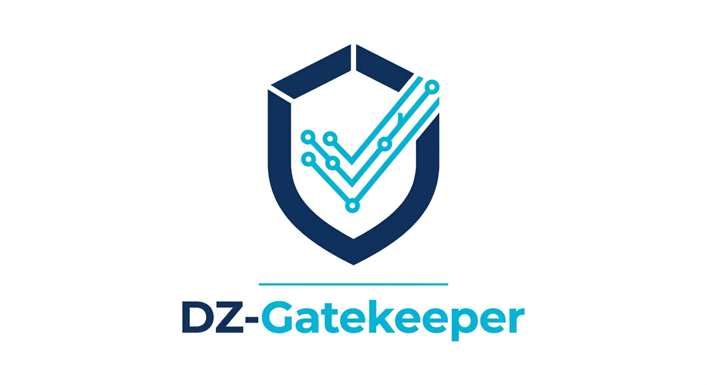

# 🚗 DZ Gatekeeper — Vehicle Import Document Validation Pipeline

> A fully local, GPU-accelerated AI pipeline that automates the validation of Algerian vehicle import dossiers — built to run on minimal hardware with zero cloud dependency, in compliance with Algerian data protection law.



---

## The Problem

Since Algeria reopened vehicle imports, ports like Skikda and Oran have been flooded with cars — the majority shipped from China. Each vehicle requires a dossier of import documents that must be carefully examined by a **transitaire** (customs agent) before the shipment can be cleared by the Algerian _Douane_ (customs authority).

This process is entirely manual today, and the consequences of errors are severe:

- A single data mismatch between documents (VIN number, consignee name, weight, HS code) can **block the entire dossier**
- Every extra day the vehicle sits in the port or container generates **demurrage fees paid by the owner**
- Transitaires handle dozens of dossiers simultaneously, under pressure, checking the same fields across 4 different documents by hand

**DZ Gatekeeper automates this.** It processes a full vehicle dossier — Invoice, Packing List, Certificate of Origin, and Technical Details Sheet — in minutes, on a standard laptop, and produces a structured validation report ready for submission to the Douane portal.

---

## Why Fully Local? — Algerian Law No. 18-07

Algeria's **Law No. 18-07** on the protection of personal data explicitly prohibits transmitting Algerian citizens' personal information outside the country without authorization. Vehicle import documents contain sensitive personal data: full name, passport number, NIN (National Identification Number), address, phone, and email.

Using a cloud AI API (OpenAI, Anthropic, Google) would mean sending this data to foreign servers — a direct violation of this law.

**Every inference in this pipeline runs locally:**

- No API calls to external services
- No data leaves the machine
- Models run entirely on local hardware via llama.cpp
- Full compliance with Law No. 18-07

---

## What It Does

Given 4 document images from a vehicle import dossier:

1. **Extracts** all text via OCR (GLM-OCR multimodal model)
2. **Classifies** each document type automatically
3. **Maps** extracted text to structured JSON schemas per document type
4. **Validates** each document individually (VIN format, totals consistency, required fields, dates)
5. **Cross-references** data across all 4 documents (VIN match, consignee consistency, weight alignment, invoice numbers)
6. **Applies Algerian import rules** (vehicle age ≤ 3 years, engine displacement limits, etc.)
7. **Produces a final decision** — approved or rejected — with detailed mismatch reports
8. **Exports structured JSON** ready for submission to the Douane online portal

---

## Pipeline Architecture

```
┌──────────────────────────────────────────────────────────────┐
│                     FastAPI + Streaming                      │
│              Live progress via NDJSON stream                 │
└───────────────────────────┬──────────────────────────────────┘
                            │
              ┌─────────────▼─────────────┐
              │       PHASE 1: OCR        │
              │   GLM-OCR Server (8081)   │
              │   Multimodal vision model │
              │   4 images → raw text     │
              └─────────────┬─────────────┘
                            │  ← server stops, VRAM freed
              ┌─────────────▼─────────────┐
              │  PHASE 2: Classification  │
              │   LLM Server (8080)       │
              │   Llama 3.2 3B Instruct   │
              │   identifies doc types    │
              └─────────────┬─────────────┘
                            │
              ┌─────────────▼─────────────┐
              │   PHASE 3: Extraction     │
              │   LLM → structured JSON   │
              │   strict per-doc schemas  │
              └─────────────┬─────────────┘
                            │  ← server stops, VRAM freed
              ┌─────────────▼─────────────┐
              │   PHASE 4: Validation     │
              │   VIN, totals, dates,     │
              │   required fields         │
              └─────────────┬─────────────┘
                            │
              ┌─────────────▼─────────────┐
              │  PHASE 5: Reconciliation  │
              │   Cross-doc consistency   │
              │   Algerian import rules   │
              │   → approved / rejected   │
              └───────────────────────────┘
```

---

## Key Engineering Decisions

### Sequential Server Management (VRAM Constraint)

The target hardware is a budget laptop GPU with 4GB VRAM. GLM-OCR requires ~2GB and the LLM requires ~2GB — they cannot coexist in VRAM simultaneously.

Rather than requiring expensive hardware, the pipeline manages this explicitly: the OCR server starts, processes all 4 images, then **stops and frees VRAM** before the LLM server starts. This makes the system viable on a GTX 1650 or any 4GB GPU, which is the realistic hardware budget for a small transitaire office.

### Persistent OCR Server (Performance)

The naive approach — spawning a new `llama-mtmd-cli` process per image — reloads the model from disk every time (~30s per image × 4 = 120s just for model loading). Instead, a persistent `llama-server` instance keeps the model in VRAM across all 4 images. Model loads once, inference runs 4 times. This cuts OCR time from ~120s to ~23s model load + ~22s per image.

### Quantized Models (Q4_K_M)

Both models use **Q4_K_M quantization** — a 4-bit quantization format that reduces model size by ~75% with minimal accuracy loss. This is what makes it possible to run a capable multimodal OCR model and a 3B parameter instruction-tuned LLM on 4GB of VRAM. Full precision (FP16) versions of these models would require 16-24GB VRAM and would be unusable on target hardware.

### Model Selection

- **GLM-OCR** — chosen specifically for its strong performance on mixed-language documents (Arabic/French/English) common in Algerian import paperwork, and its ability to handle low-quality scans
- **Llama 3.2 3B Instruct** — chosen for its strong instruction-following on structured JSON extraction tasks at 3B parameters, which fits within 2GB VRAM at Q4_K_M quantization

### CLI vs Server for OCR

The OCR uses `llama-server` (HTTP API) rather than `llama-mtmd-cli` (subprocess per image) — same model, same weights, same accuracy, but with the persistent server eliminating per-call model loading overhead.

---

## Tech Stack

| Layer            | Technology                                      |
| ---------------- | ----------------------------------------------- |
| API              | FastAPI + streaming NDJSON                      |
| OCR              | GLM-OCR Q4_K_M via llama-server                 |
| LLM              | Llama 3.2 3B Instruct Q4_K_M via llama-server   |
| Inference engine | llama.cpp (compiled from source with CUDA 12.4) |
| Container        | Docker multi-stage build                        |
| GPU passthrough  | nvidia-container-toolkit                        |
| Tests            | pytest + pytest-asyncio (39 tests)              |

---

## Requirements

### Hardware

- NVIDIA GPU with **4GB+ VRAM** (tested on GTX 1650)
- nvidia-container-toolkit installed on host
- 8GB+ RAM
- 15GB+ free disk (models + Docker image)

### Software

- Docker Desktop
- Git

---

## Getting Started

### 1. Clone the repo

```bash
git clone https://github.com/radx007/dz-gatekeeper.git
cd dz-gatekeeper
```

### 2. Download the models

Place these 3 files inside a `models/` folder:

| Model                               | Source                                                                                                            |
| ----------------------------------- | ----------------------------------------------------------------------------------------------------------------- |
| `GLM-OCR.Q4_K_M.gguf`               | [HuggingFace — nopesadly/GLM-OCR-Q4_K_M.gguf](https://huggingface.co/nopesadly/GLM-OCR-Q4_K_M.gguf/tree/main)     |
| `mmproj-GLM-OCR-Q4_K_M.gguf`        | Same repo as above                                                                                                |
| `Llama-3.2-3B-Instruct-Q4_K_M.gguf` | [HuggingFace — bartowski/Llama-3.2-3B-Instruct-GGUF](https://huggingface.co/bartowski/Llama-3.2-3B-Instruct-GGUF) |

```
models/
├── GLM-OCR.Q4_K_M.gguf
├── mmproj-GLM-OCR-Q4_K_M.gguf
└── Llama-3.2-3B-Instruct-Q4_K_M.gguf
```

### 3. Configure environment

```bash
cp .env.example .env
```

Default values work out of the box for Docker. No changes needed.

### 4. Run

```bash
docker compose up
```

Docker pulls the pre-built image from GitHub Container Registry (~5GB, one-time). No compilation needed.

API available at `http://localhost:8000`.

---

## API

### `POST /process-documents`

Send 4 document images. Returns a live NDJSON stream:

```json
{"type": "ocr_started", "filename": "invoice.png"}
{"type": "ocr_completed", "filename": "invoice.png"}
{"type": "phase_started", "phase": "classification"}
{"type": "classification_completed"}
{"type": "extraction_completed", "filename": "invoice.png"}
{"type": "validation_completed", "filename": "invoice.png", "data": {...}}
{"type": "reconciliation_completed"}
{"type": "completed", "result": {
    "documents": [...],
    "failed_documents": [...],
    "decision": {"status": "approved" | "rejected", ...}
}}
```

---

## Performance

Tested on **GTX 1650 4GB / Ryzen 5 5500U / 16GB RAM** running inside Docker:

| Phase                         | Time           |
| ----------------------------- | -------------- |
| OCR — model load (once)       | ~7s           |
| OCR — per image inference × 4 | ~13s each      |
| LLM server start              | ~10s           |
| Classification (4 docs)       | ~15s           |
| Extraction (4 docs)           | ~70s          |
| Validation + Reconciliation   | <1s            |
| **Total**                     | **~2.66 minutes** |

---

## Running Tests

No GPU or models required — all external services are mocked.

```bash
pip install -r requirements.txt
pytest -q
```

39 tests covering: document validation, cross-document reconciliation, Algerian import rules, OCR service, LLM mapping, API endpoints, and full pipeline integration.

---

## Project Structure

```
├── app/
│   ├── api/              # FastAPI routes
│   ├── pipeline/         # Main orchestration pipeline
│   ├── services/         # OCR, LLM, classification, validation, reconciliation
│   ├── utils/            # Server lifecycle managers (GLM-OCR, LLM)
│   └── config.py         # Settings and environment
├── tests/                # 39 pytest tests
├── models/               # Model files (not committed — download separately)
├── Dockerfile            # Multi-stage CUDA 12.4 build
├── docker-compose.yml    # GPU passthrough + model volume mount
└── .env.example          # Environment template
```

---